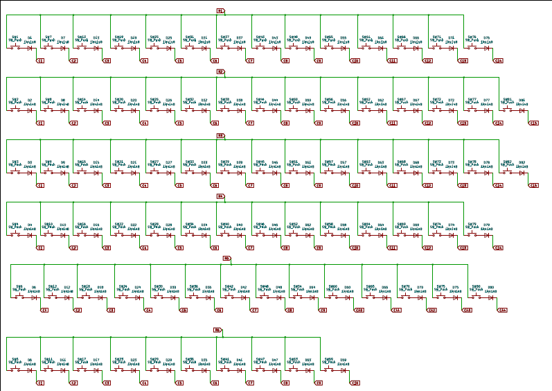
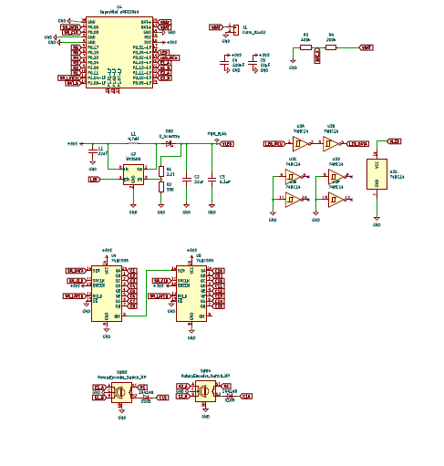
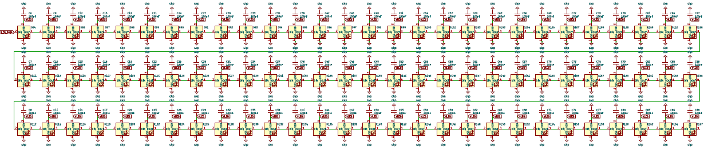
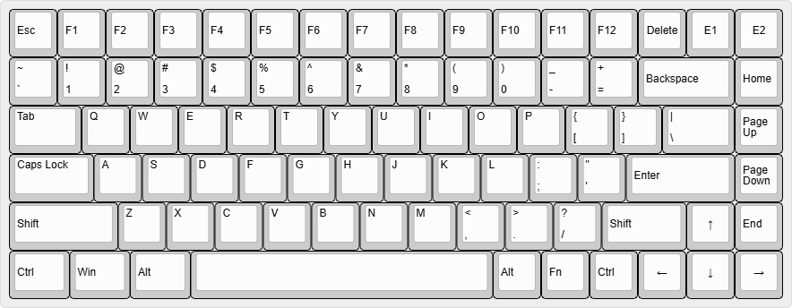

# May 26th, 2026: Started working on things

Started this project, went through a few things on the internet and decided to use nRF52840 Dev board as the main micro-controller because it is usually used in wireless keyboard.
Also decided to use Xiao 2040 for the dock-able screen part which will be hardwired as that thing will only consist of a screen, MCU and battery. 
Also worked on the schematic part, figured out the layout, number of switches and encoders, battery stuff, etc.
This is my first time working on something this big... Soo it took me some time to figure things out like battery, resisters, shift resisters, etc.
Finally finished the schematic, learned a few things about MT3608 and 74HC14, which i used to convert/step up the 3.3v to 5v which is good for the leds.
Also decided to have per key under-glow led and added two encoders instead of one. 

NOTE: This was done over 3 - 4 days cause i was researching and testing new stuff. 

Also this is the layout i decided to go with (E1 and E2 are encoders)

**Total time spent: 6h**

# May 30th, 2026: PCB time
First i updated the layout in the KLE which i then exported and used in the KLE kicad plugin.
With the help of claude and a plugin for placing the keys and diodes i finished up the placing part really quickly. 
I also decided to place things like the MCU, battery and all the other stuff on the left side as the right side will have the magnets which will help me dock the screen and any other dock able thing if i plan to make.
I wrote a script with the help of claude to place the leds and its corresponding capacitor near the switches. 

Then i started one of the most difficult and time taking task for me which is routing. 
First i started doing the rows followed by the leds an other things like the battery sense resistors and the MT3608. After that i started routing the diodes to the switches (easiest part). Then i started with leds which was a little bit difficult. I moved the led capacitors again and again to find them the perfect place. While routing the leds I realized that I had not connected the columns. The 74HC595 shift register was on the other side of the pcb and made it difficult to connect it to the first few columns cause the led and the rows routing had taken up the few paths to run the long lines of copper to connect them.

**Total time spent: 4h**

# June 20th, 2026: PCB time continued 
After not touching this project for the last few days, i came back to this with more research and a change in idea. I have decided to add a dock-able macropad instead of a screen on the side of the keyboard. I moved the screen to the top side. In theory/planning i have decided to make it such that it will be small and will dock/connect/snap on to the keyboard or the macropad. The screen will still be the only component which will need a wired connection to run. 

The macropad will have 16 keys and a encoder, a nRF52840 (same one as the kb) and maybe per key under glow like the kb.

Now update on the pcb of the main KB, i am still working on routing everything. The columns are really difficult to route. For some reason (which i soooo not remember), the capacitors had moved places, so i had to move them all again. Lesson learnt, do not work on pcb while sleepy 

Same day update: Nearly finished the columns routing and the led routing. 
Finally finished the whole routing for the main KB pcb...... Rerouted a few things, made to many connections using vias.

**Total time spent: 6h**

# June 25th, 2026: Schematic 2 (Macro Pad)
Fixed all the drc errors for the main KB; ALso added the pogo pins to the pcb and schematic.

Started working on the schematic of the macropad which was way easier than the Kb. . Key features include 16 keys, 1 encoder and nRF52840.

Also started working on the pcb after i completed the schematic designing. Completed the PCB, redid the design multiple times, still figuring out what to add on the receiving side of the pogo pins. Finally the macro pad consists of 15 keys (3*5 matrix), 2 encoders and a nRF52840. 

**Total time spent: 5h**

# July 15th, 2026: Finishing the PCB design and starting Case designing
I finally decided to add copper pads on the surface of the pcb and make the case in such a way that the pogo pins will rest on top of the pcb.

Added mounting holes on the pcbs and then started working on the case.

### CASE 1: Keyboard
Started working on the case design of the main keyboard. At first i thought that i would make a typing angle in the keyboard and started working on it. Later i decided to just make a normal base because i was running into problems while making the angle thingy. I was not able to place the pcb properly according to the angle.... I will learn more about 3d des and come back to this in my next kb version.

Then i made small changes to the initiall design of the case and also the positioning of the pogo pins on the pcb. I then imported the pcb into fusion so i could add proper mounting holes and stuff. 

Later I made cutouts for pogo pins and charging port and decided not to make a top yet.
Also decided to not make a different compartment for battery and will keep it just below the pcb, hopefully it should fit there.

**Lapse links and Images**
https://lapse.hackclub.com/timelapse/A4WhkUfEeMN5
https://lapse.hackclub.com/timelapse/ywpzmXBKPaUQ

**Updated and final keyboard pcb**

# July 16th, 2026: Macro-pad case and organizing repo.

### CASE 2: Macro-pad
Made the macro pad case similar to the keyboard case. Made the cutouts and stuff...

Also made a covering for both of the cases and tried putting them both together in fusion trying to see if my design is perfect or not.

While making the final part, i forgot to press resume on my lapse..... only a few minutes of work though.

After making the cases, i started uploading all the files to this repo and tried to make the repo perfect.

**Lapse links and Images**
https://lapse.hackclub.com/timelapse/bDEIflPvGz7Y

**Updated and final macro pad pcb**

**Images of completed cases**

